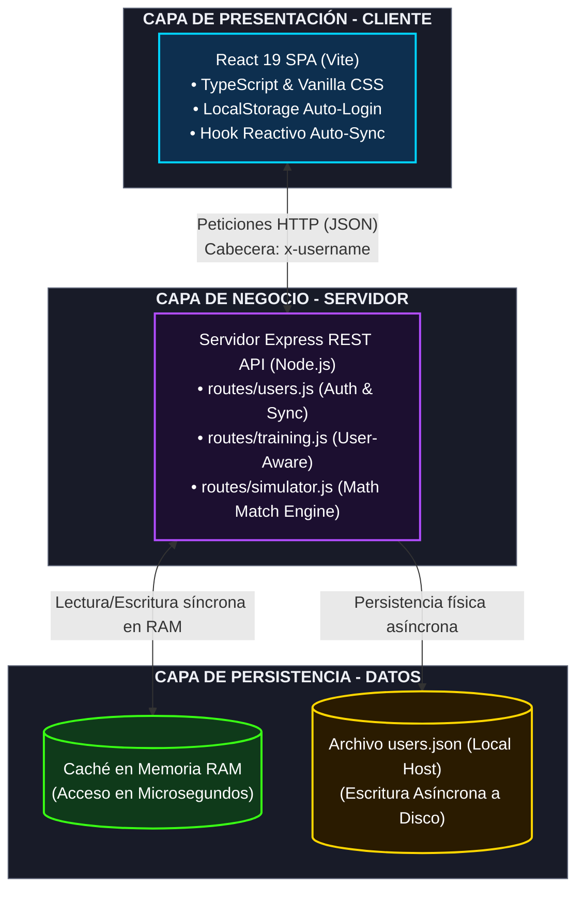
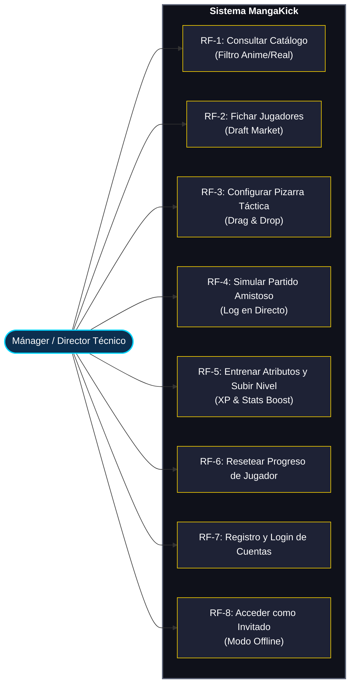
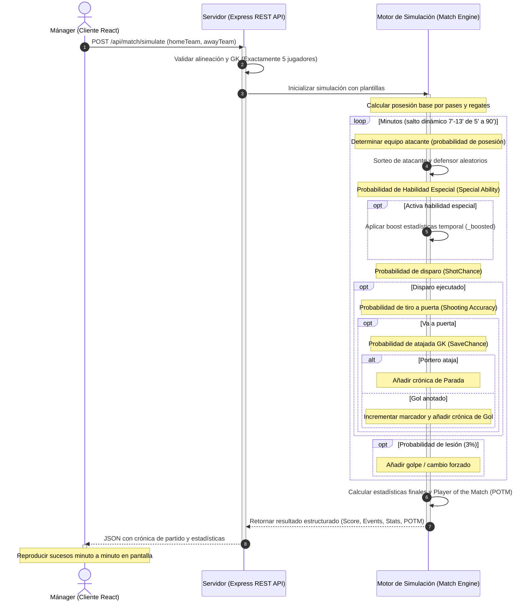

# UNIVERSIDAD MIGUEL HERNÁNDEZ DE ELCHE
## ESCUELA POLITÉCNICA SUPERIOR DE ELCHE
### GRADO EN INGENIERÍA INFORMÁTICA EN TECNOLOGÍAS DE LA INFORMACIÓN

<br><br><br>

# **MangaKick: El Mundial de Anime y Fútbol**
## *Simulador Táctico Web Híbrido con Personajes de Anime y Futbolistas Reales*

<br><br><br>

### **TRABAJO FIN DE GRADO**

**Fecha:** Mayo - 2026

**AUTOR:** Jose Luis Llorens Climent  
**DIRECTOR/ES:** *[Sin director asignado]*


<!-- PAGE BREAK -->
<div style='page-break-after: always;'></div>

# RESUMEN

El presente Trabajo Fin de Grado describe el diseño, desarrollo e implementación de **MangaKick**, una innovadora aplicación web híbrida que fusiona la gestión táctica de fútbol con el universo del anime y los futbolistas de la élite real. El sistema permite a los usuarios actuar como directores técnicos de un equipo personalizado, permitiéndoles fichar deportistas emblemáticos reales (como Lionel Messi, Cristiano Ronaldo o Erling Haaland) y personajes icónicos de populares series animadas de temática futbolística e hiperfantástica (como *Blue Lock*, *Captain Tsubasa*, *Inazuma Eleven*, *Dragon Ball* y *Naruto*).

A nivel tecnológico, el proyecto se ha estructurado bajo una arquitectura de tres capas utilizando el stack moderno de JavaScript/TypeScript. En el frontend, se ha desarrollado una interfaz de usuario inmersiva, interactiva y de alta calidad visual utilizando **React 19**, **Vite** y **TypeScript**, estandarizando estilos premium con **Vanilla CSS** responsivo para garantizar una experiencia óptima en cualquier dispositivo. En el backend, se ha construido un servidor robusto en **Node.js** con el framework **Express**, que implementa una API REST para gestionar operaciones esenciales como la simulación matemática y probabilística de encuentros de fútbol (teniendo en cuenta estadísticas y habilidades especiales de cada jugador), el mercado de fichajes (*Draft Market*) y el centro de entrenamiento (*Training Center*).

La solución de infraestructura se ha completado mediante la contenedorización de ambos servicios a través de **Docker** y **Docker Compose**, simplificando drásticamente el despliegue del entorno y garantizando su portabilidad absoluta. Los resultados demuestran la viabilidad técnica de combinar algoritmos de simulación deportiva con interfaces dinámicas enriquecidas, logrando un producto funcional de alto impacto visual y rendimiento óptimo que sirve como excelente demostración práctica de ingeniería de software.

**Palabras clave:** Simulador Táctico, Fútbol, Anime, React 19, Node.js, TypeScript, API REST, Docker, Simulación Probabilística.

---

# AGRADECIMIENTOS

Quiero expresar mi sincero agradecimiento a todas las personas que han hecho posible la realización de este Trabajo Fin de Grado.

En primer lugar, a la **Universidad Miguel Hernández de Elche** y, de forma particular, a la **Escuela Politécnica Superior de Elche**, por proporcionarme las herramientas, la formación y el entorno académico necesarios durante estos años de grado. Las asignaturas de Ingeniería del Software, Tecnologías Web y Arquitectura de Sistemas han sido pilares fundamentales para el planteamiento técnico de este proyecto.

A mis compañeros de carrera, con quienes he compartido largas horas de estudio, proyectos grupales y debates apasionantes que han enriquecido enormemente mi aprendizaje.

Y, por último, pero más importante, a mi familia y seres queridos, cuyo apoyo incondicional, paciencia y aliento constante han sido mi mayor motivación para culminar con éxito esta etapa de mi vida académica. A todos ellos les dedico este trabajo.

---

# ÍNDICE GENERAL

*   **Capítulo 1: Introducción**
    *   1.1. Entorno de Aplicación y Sector
    *   1.2. Justificación del Proyecto
    *   1.3. Objetivos
        *   1.3.1. Objetivo Principal
        *   1.3.2. Objetivos Secundarios
        *   1.3.3. Objetivos Personales
    *   1.4. Límites del Proyecto
*   **Capítulo 2: Antecedentes y Estado de la Cuestión**
    *   2.1. Situación Actual y Problemática
    *   2.2. Herramientas Disponibles en el Mercado
        *   2.2.1. Football Manager
        *   2.2.2. Captain Tsubasa: Rise of New Champions
        *   2.2.3. Inazuma Eleven: Victory Road
    *   2.3. Cuadro Comparativo y Valoración
*   **Capítulo 3: Hipótesis de Trabajo y Tecnologías**
    *   3.1. Arquitectura del Sistema
    *   3.2. Tecnologías del Cliente (Frontend)
        *   3.2.1. React 19 y Vite
        *   3.2.2. TypeScript
        *   3.2.3. HSL CSS y Microanimaciones Dinámicas
    *   3.3. Tecnologías del Servidor (Backend)
        *   3.3.1. Node.js y Express
        *   3.3.2. Base de Datos en Memoria y API REST
    *   3.4. Entorno de Despliegue y Contenedores (Docker)
*   **Capítulo 4: Metodología y Resultados**
    *   4.1. Ciclo de Vida y Planificación (Metodología Ágil)
        *   4.1.1. Fases del Proyecto
        *   4.1.2. Diagrama de Gantt
    *   4.2. Captura y Especificación de Requisitos
        *   4.2.1. Roles de Usuario
        *   4.2.2. Casos de Uso del Sistema
        *   4.2.3. Requisitos No Funcionales
    *   4.3. Diseño del Sistema
        *   4.3.1. Diagrama de Arquitectura
        *   4.3.2. Modelo de Datos de Jugadores
        *   4.3.3. Diseño de la Interfaz Gráfica (UI/UX)
    *   4.4. Implementación y Detalles del Código
        *   4.4.1. Lógica del Simulador Probabilístico de Partidos
        *   4.4.2. Sistema de Entrenamiento y Progresión
        *   4.4.3. Integración de Imágenes y Carga Dinámica
    *   4.5. Pruebas y Despliegue Dockerizado
*   **Capítulo 5: Conclusiones y Trabajo Futuro**
    *   5.1. Conclusiones
    *   5.2. Posibles Desarrollos Futuros
*   **Capítulo 6: Bibliografía**

---

# ÍNDICE DE TABLAS

*   **Tabla 2.1:** Comparativa Detallada de Características entre MangaKick y Competidores Comerciales.
*   **Tabla 3.1:** Comparativa de Rendimiento y Portabilidad de Motores de Persistencia.
*   **Tabla 4.1:** Tabla de Planificación y Tiempos de Sprints del Desarrollo del Software.
*   **Tabla 4.2:** Tabla de Especificación del Caso de Uso "Simular Partido".
*   **Tabla 4.3:** Estructura de Atributos de los Jugadores en la Base de Datos.

---

# ÍNDICE DE FIGURAS

*   **Figura 3.1:** Diagrama de Arquitectura de Tres Capas (Frontend, Backend, Docker).
*   **Figura 4.1:** Cronograma y Diagrama de Gantt del Proyecto.
*   **Figura 4.2:** Diagrama de Casos de Uso UML del Sistema MangaKick.
*   **Figura 4.3:** Diagrama de Secuencia de la Simulación de un Partido.
*   **Figura 4.4:** Boceto de la Interfaz Principal y Pizarra Táctica (Wireframe).
*   **Figura 4.5:** Captura de Pantalla Real de la Alineación y Pizarra Táctica del Terreno de Juego.
*   **Figura 4.6:** Captura de Pantalla del Mercado de Fichajes (*Draft Market*).
*   **Figura 4.7:** Captura de Pantalla del Centro de Entrenamiento (*Training Center*).
*   **Figura 4.8:** Captura de Pantalla del Simulador de Partido en Tiempo Real.


<!-- PAGE BREAK -->
<div style='page-break-after: always;'></div>

# Capítulo 1: Introducción y Objetivos

## 1.1.- ENTORNO DE APLICACIÓN Y CONTEXTO DEL SECTOR

El sector del entretenimiento interactivo y los videojuegos ha experimentado un crecimiento exponencial en la última década, consolidándose como la industria cultural más lucrativa a nivel global. Dentro de este vasto ecosistema, los simuladores de gestión deportiva (particularmente los mánagers de fútbol como *Football Manager*) y los videojuegos basados en franquicias de animación japonesa (*anime*) representan dos nichos de mercado extraordinariamente rentables, pero tradicionalmente disjuntos.

Por un lado, los simuladores tácticos de fútbol comercializados actualmente se caracterizan por una altísima complejidad matemática, menús repletos de texto y un enfoque hiperrealista que a menudo resulta árido o intimidante para el usuario casual. Por otro lado, los videojuegos basados en licencias de anime deportivo como *Captain Tsubasa* (Oliver y Benji), *Inazuma Eleven* o el reciente fenómeno de masas *Blue Lock* apuestan casi exclusivamente por dinámicas de acción puramente *arcade*, velocidad frenética y mecánicas de juego en tiempo real que dejan de lado el factor de planificación estratégica y análisis estadístico minucioso.

El entorno de aplicación de este proyecto, bautizado como **MangaKick**, se sitúa precisamente en la intersección de estas dos vertientes. MangaKick se concibe como un **Simulador Táctico Web Híbrido** que extrae el rigor estratégico de los simuladores clásicos y lo fusiona con la narrativa épica y visualmente espectacular del anime deportivo. El proyecto no se concibe para una empresa externa específica, sino como un producto de software libre de distribución digital dirigido al sector de entretenimiento de consumo masivo, con un fuerte enfoque educativo dentro del Grado en Ingeniería Informática de la Universidad Miguel Hernández.

Para hacer viable este desarrollo, se ha dispuesto de un entorno técnico y tecnológico moderno, compuesto por:
1.  **Estaciones de Trabajo Locales:** Equipos equipados con sistemas operativos modernos (Windows/Linux) optimizados para el desarrollo ágil de software.
2.  **Entorno de Desarrollo Integrado (IDE):** Visual Studio Code como herramienta central, potenciada con extensiones de linting, tipado y formateo automático de código.
3.  **Motor de Ejecución de Javascript:** Node.js como núcleo para la gestión de dependencias locales y la ejecución del servidor de la API en el backend.
4.  **Plataforma de Contenedores:** Docker y Docker Desktop, permitiendo la virtualización ligera y aislada del servidor Express y del cliente Vite/React, garantizando que el software funcione de manera idéntica en cualquier máquina sin necesidad de configurar manualmente dependencias del sistema operativo anfitrión.

---

## 1.2.- JUSTIFICACIÓN DEL PROYECTO

La decisión de diseñar e implementar MangaKick responde a una serie de necesidades técnicas, motivaciones conceptuales y justificaciones académicas que dotan de pleno sentido al desarrollo de este Trabajo Fin de Grado. 

Desde una perspectiva técnica, el desarrollo de aplicaciones web de alto rendimiento se enfrenta hoy al reto de la saturación de librerías y frameworks pesados que ralentizan la carga y penalizan la experiencia del usuario. Tradicionalmente, los juegos y simuladores interactivos se han desarrollado utilizando motores pesados como Unity o Unreal Engine compilados para la web mediante WebAssembly, lo que se traduce en tiempos de descarga de cientos de megabytes y un consumo excesivo de memoria en los navegadores de los usuarios. **MangaKick se justifica técnicamente como una alternativa ultraligera**: una SPA (Single Page Application) desarrollada con tecnologías web estándar puras (**React 19, TypeScript y Vanilla CSS**) capaz de cargar de forma instantánea en menos de un segundo y de ejecutar simulaciones complejas de partidos con un consumo mínimo de recursos de CPU.

Desde un punto de vista conceptual, existe un vacío claro en el mercado de simuladores. Los fans del fútbol táctico no disponen de una plataforma donde poner a prueba teorías como: *"¿Qué ocurriría si alineo a Yoichi Isagi (de Blue Lock) con Lionel Messi en un sistema de doble delantero, apoyados por el pase perfecto de Tetsuya Kuroko en el centro del campo?"*. MangaKick proporciona este espacio de experimentación mediante una simulación que analiza matemáticamente el rendimiento de deportistas reales y de ficción bajo un mismo conjunto de reglas físicas y estadísticas homogeneizadas.

### 1.2.1.- Justificación Académica e Ingeniería del Software
A nivel académico, este proyecto justifica la aplicación práctica de metodologías avanzadas de Ingeniería del Software adquiridas durante la carrera. La estructuración de una arquitectura desacoplada cliente-servidor (Frontend-Backend), la implementación de patrones de diseño de software (como el patrón creador, experto en información y alta cohesión/bajo acoplamiento), y la aplicación de tipado estricto con TypeScript justifican la calidad del código. Asimismo, el uso de Docker y la orquestación mediante Docker Compose reflejan las prácticas modernas de DevOps indispensables en la industria actual del desarrollo de software.

### 1.2.2.- Justificación de Viabilidad Comercial y Producto Explotable
Aunque este Trabajo Fin de Grado tiene una finalidad primordialmente educativa y no comercial debido a los derechos de propiedad intelectual de los personajes incluidos, la arquitectura interna de MangaKick se ha diseñado de forma que sea **100% modular y escalable**. Esto significa que las interfaces y el motor de simulación están completamente desacoplados de los datos de los jugadores. En un escenario de explotación comercial, bastaría con sustituir las imágenes y nombres bajo propiedad intelectual por assets licenciados o de creación propia para convertir MangaKick en un juego listo para su monetización a través de publicidad integrada, microtransacciones (adquisición de sobres de jugadores o drills de entrenamiento) o un modelo de suscripción premium.

### 1.2.3.- Justificación del Enfoque Visual y la Experiencia del Usuario (UI/UX)
El desarrollo web moderno exige que los interfaces de usuario dejen de ser meros formularios estáticos y pasen a ser entornos visuales inmersivos. MangaKick justifica la investigación y el uso de **Vanilla CSS avanzado y HSL** (Hue, Saturation, Lightness) para crear una estética premium sin la sobrecarga de dependencias como Tailwind CSS. Al diseñar efectos de glassmorphism, gradientes lineales dinámicos y microanimaciones de cartas de jugadores en CSS puro, se demuestra que se pueden alcanzar cotas de excelencia visual sobresalientes manteniendo el rendimiento y la mantenibilidad a largo plazo.

---

## 1.3.- OBJETIVOS DEL PROYECTO

Para guiar el desarrollo de MangaKick y permitir una evaluación objetiva de sus resultados al finalizar el proyecto, se han establecido metas divididas en tres categorías diferenciadas: objetivos principales, objetivos secundarios y objetivos personales del autor.

### 1.3.1.- Objetivo Principal
El objetivo principal del proyecto consiste en **diseñar, implementar y desplegar una plataforma web interactiva y modular para la simulación táctica de fútbol**, que permita la creación de equipos híbridos (personajes de anime y futbolistas reales), su entrenamiento funcional, la configuración táctica detallada de alineaciones y la simulación matemática probabilística de partidos en tiempo real, garantizando un despliegue simplificado mediante contenedores virtuales.

### 1.3.2.- Objetivos Secundarios
Para dar cumplimiento al objetivo principal, se desglosan los siguientes objetivos específicos o secundarios de ingeniería:
1.  **Desarrollo del Motor de Simulación Probabilístico (Match Engine):** Programar un algoritmo en el backend que calcule las dinámicas de un partido minuto a minuto, analizando las estadísticas confrontadas de ataque y defensa de los jugadores en el campo, resolviendo el uso de habilidades especiales mediante coeficientes probabilísticos y generando una crónica textual dinámica de los sucesos clave (goles, faltas, intervenciones del portero).
2.  **Construcción de una Interfaz Dinámica Premium (Frontend):** Diseñar una interfaz interactiva tipo Single Page Application (SPA) que contemple pantallas de Gestión de Plantilla, Pizarra Táctica (arrastrar y posicionar jugadores), Mercado de Fichajes (*Draft Market*) con filtros por tipo de jugador, y un Centro de Entrenamiento funcional.
3.  **Estructuración de una API REST Coherente (Backend):** Crear un servicio backend desacoplado que exponga endpoints estructurados para el consumo de datos de jugadores, ejecución de simulaciones, y entrenamiento con persistencia temporal durante la sesión del usuario.
4.  **Implementación de Contenedores de Infraestructura (DevOps):** Crear archivos Dockerfile optimizados para las tecnologías utilizadas y configurar un manifiesto de Docker Compose que levante tanto el cliente de React en Vite como el servidor Express mediante un único comando en consola (`docker-compose up --build`).
5.  **Aseguramiento de la Calidad y Robustez del Código:** Aplicar tipado estricto en el frontend mediante TypeScript para evitar errores en tiempo de ejecución y estructurar el backend siguiendo buenas prácticas de modularidad de rutas y controladores de Express.

### 1.3.3.- Objetivos Personales
Adicionalmente, como autor del Trabajo Fin de Grado, persigo los siguientes hitos de crecimiento profesional y académico:
1.  **Dominio Completo del Ecosistema de React 19 y Vite:** Comprender e implementar las últimas directrices de optimización en la renderización de componentes funcionales y la gestión avanzada del estado local sin recurrir a complejas librerías externas de terceros.
2.  **Profundización en Diseño Web con CSS Puro:** Demostrar habilidad en el diseño de interfaces modernas aplicando técnicas de flexbox, grid, animaciones de transición fluidas, efectos de desenfoque y diseño adaptativo a pantallas de móviles, tabletas y ordenadores sin el soporte de utilidades prefabricadas.
3.  **Adopción de Prácticas Profesionales de Despliegue (Docker):** Familiarizarme de manera práctica con la tecnología de contenedores y los flujos de trabajo de integración y despliegue continuos (CI/CD), una competencia altamente demandada en el mercado laboral actual.
4.  **Desarrollo de un Algoritmo Matemático Complejo:** Enfrentarme al desafío de programar un motor de simulación equilibrado y justo, ajustando coeficientes matemáticos para que los partidos reflejen con coherencia la superioridad o debilidad estadística de los equipos confrontados.

---

## 1.4.- LÍMITES DEL PROYECTO

Con el fin de delimitar el alcance del proyecto y evitar una desviación de recursos que comprometa la entrega del Trabajo Fin de Grado, se definen explícitamente los límites de MangaKick en esta fase de desarrollo:

1.  **Inexistencia de Multijugador en Tiempo Real Online:** El sistema está diseñado para un único usuario local en cada sesión. Las partidas y torneos se juegan contra la inteligencia artificial (IA) del sistema (que genera alineaciones enemigas coherentes de forma automática). La implementación de juego online síncrono mediante tecnologías como WebSockets queda fuera del alcance de este TFG.
2.  **Persistencia Híbrida Local (Sin Motor Externo):** Para maximizar la velocidad de respuesta, simplificar el despliegue del entorno y evitar la sobrecarga que supone configurar y administrar un motor de base de datos externo pesado (como PostgreSQL o MongoDB) en máquinas cliente, la aplicación utiliza un sistema de persistencia híbrido. El backend opera sobre la memoria RAM (caché) para garantizar tiempos de respuesta en microsegundos y sincroniza de forma asíncrona los perfiles y el progreso de los mánagers en un archivo local indexado en disco (`backend/data/users.json`). La adopción de un sistema gestor de bases de datos relacional o documental dedicado en la nube queda fuera del alcance de este proyecto y se pospone para futuras iteraciones.
3.  **Restricción de Licencias y Assets:** MangaKick es un proyecto con fines puramente académicos y demostrativos. Las imágenes, logos y nombres de los personajes de anime y futbolistas profesionales se utilizan bajo la doctrina del *"Fair Use"* (Uso Legítimo) para fines educativos. Por lo tanto, el software no incluye ningún sistema de monetización real ni pasarelas de pago, y no está destinado a su publicación en tiendas oficiales de aplicaciones ni a su explotación comercial bajo esta marca.
4.  **Ausencia de Simulación Gráfica 2D/3D Compleja del Partido:** Durante el transcurso de los partidos, la visualización se realiza a través de un panel táctico interactivo que representa la distribución del campo y un log o crónica textual detallada generada dinámicamente que describe las jugadas minuto a minuto. No se incluye en este proyecto la renderización gráfica animada en dos o tres dimensiones (2D/3D) de los futbolistas corriendo por el campo de juego.


<!-- PAGE BREAK -->
<div style='page-break-after: always;'></div>

# Capítulo 2: Antecedentes y Estado de la Cuestión

## 2.1.- SITUACIÓN ACTUAL Y PROBLEMÁTICA DEL SECTOR

En la actualidad, el ámbito de los videojuegos de fútbol está dominado de forma hegemónica por grandes producciones comerciales de presupuestos multimillonarios. Franquicias consagradas como *EA Sports FC* (anteriormente conocido como *FIFA*) o *eFootball* (antiguo *Pro Evolution Soccer*) acaparan la práctica totalidad del mercado. Estas producciones centran sus esfuerzos de desarrollo en dos pilares fundamentales: el fotorrealismo gráfico tridimensional de última generación y los modelos de monetización agresivos basados en la adquisición de sobres de cromos virtuales (*Ultimate Team*).

Esta coyuntura del sector plantea tres problemáticas esenciales que motivan la concepción de una alternativa como MangaKick:

1.  **Exclusión del Juego Casual y Dependencia de Hardware de Gama Alta:** Las superproducciones de fútbol actuales requieren consolas de videojuegos especializadas de última generación (PlayStation 5, Xbox Series X/S) o tarjetas gráficas de gama alta en ordenadores personales para poder ejecutarse. Además, sus archivos ocupan más de 100 gigabytes de almacenamiento en disco y exigen actualizaciones masivas constantes. Esto excluye por completo al usuario casual que dispone de un ordenador de oficina ligero o un dispositivo móvil y desea disfrutar de una partida rápida sin tiempos de descarga ni requisitos técnicos prohibitivos.
2.  **Ruptura Abrupta entre Realismo y Fantasía Deportiva:** Los simuladores tácticos puros, liderados por la saga *Football Manager*, ofrecen bases de datos realistas de dimensiones colosales, pero su estética visual es extremadamente fría, semejante a hojas de cálculo de oficina, careciendo de elementos de dinamismo visual, épica y fantasía. Por contra, los juegos basados en franquicias de anime (como *Inazuma Eleven*) relegan el realismo estratégico y estadístico en favor de una jugabilidad meramente fantástica infantil, sin ofrecer ningún vínculo con el fútbol de la élite real contemporánea.
3.  **Hermetismo en Licencias y Crossovers Creativos:** Debido a restricciones contractuales y comerciales muy estrictas, los jugadores de fútbol real nunca interactúan con los personajes de ficción en las plataformas comerciales. Los usuarios se ven obligados a jugar en universos separados. Un jugador apasionado por la táctica de Pep Guardiola y, al mismo tiempo, por el análisis analítico de Yoichi Isagi en *Blue Lock* no dispone de ningún canal digital donde experimentar la simbiosis táctica de ambos mundos bajo reglas comunes.

Ante este panorama, la problemática reside en la falta de un **sistema web de acceso libre, ligero, interactivo y visualmente inmersivo** que ofrezca un entorno de simulación táctica híbrido. MangaKick se propone resolver este vacío sectorial proporcionando una aplicación web modular que se ejecuta directamente desde cualquier navegador estándar en milisegundos, democratizando el acceso a los juegos de gestión estratégica y posibilitando el crossover definitivo entre el fútbol real y el de animación japonesa.

---

## 2.2.- HERRAMIENTAS DISPONIBLES EN EL MERCADO

A fin de situar a MangaKick en el espectro tecnológico actual, se ha llevado a cabo una investigación analítica de las principales herramientas y videojuegos de gestión o fútbol que operan actualmente en el mercado y que guardan relación conceptual o técnica con nuestro proyecto.

### 2.2.1.- Football Manager (Sports Interactive / SEGA)

*Football Manager* es indiscutiblemente el referente absoluto en el sector de la simulación de gestión deportiva. Esta herramienta cuenta con una base de datos de cientos de miles de futbolistas reales actualizada minuciosamente por una red global de ojeadores profesionales.

*   **Puntos Fuertes:** Su motor de simulación táctica es extremadamente maduro y simula la física del partido con gran precisión tridimensional o bidimensional. Ofrece una profundidad de gestión sin parangón, abarcando desde entrenamientos específicos, contratos de patrocinio, ruedas de prensa, hasta dinámicas psicológicas de vestuario.
*   **Puntos Débiles:** Su interfaz de usuario es densa, monótona y excesivamente analítica, orientada exclusivamente a un perfil de jugador entusiasta de la estadística pura. Su curva de aprendizaje es extremadamente pronunciada, requiriendo decenas de horas de aprendizaje básico. Además, carece por completo de elementos de animación estilizada o fantasía épica, y su coste de adquisición anual es elevado.

### 2.2.2.- Captain Tsubasa: Rise of New Champions (Tamsoft / Bandai Namco)

Lanzado en 2020 para consolas y PC, este título traslada el universo del clásico anime *Oliver y Benji* (Captain Tsubasa) a las tres dimensiones con una fidelidad visual notable mediante la técnica artística de *Cel Shading*.

*   **Puntos Fuertes:** Destaca por su espectacularidad visual. Las jugadas especiales de los protagonistas, como el famoso "Tiro del Tigre" de Mark Lenders (Kojiro Hyuga) o la "Catapulta Infernal" de los hermanos Derrick, se representan mediante espectaculares cinemáticas integradas que transmiten una inmensa sensación de poder e impacto emocional.
*   **Puntos Débiles:** Es un juego estrictamente *arcade* de fútbol en tiempo real enfocado en el manejo directo con mando de juego. Carece casi por completo de profundidad táctica: no existe la gestión estratégica de plantillas a largo plazo, ni pizarras tácticas dinámicas basadas en roles posicionales, ni progresión científica de estadísticas individuales. Su rendimiento requiere hardware de gama media-alta y su portabilidad en la web es inexistente.

### 2.2.3.- Inazuma Eleven: Victory Road (Level-5)

La franquicia *Inazuma Eleven* es el mayor exponente del género RPG de fútbol fantástico. Este último título unifica la jugabilidad táctica sobre la pantalla táctil con los partidos tradicionales de rol deportivo.

*   **Puntos Fuertes:** Posee un sistema de estadísticas muy estructurado y un sistema de progresión de personajes sobresaliente, donde el entrenamiento de los jugadores influye decisivamente en el poder de sus técnicas especiales. Las mecánicas de confrontación entre jugadores combinan elementos de rol con toma de decisiones rápidas.
*   **Puntos Débiles:** Es una plataforma comercial cerrada y exclusiva de consolas de sobremesa (Nintendo Switch, PlayStation) y dispositivos móviles nativos. No cuenta con ninguna conexión con la realidad del fútbol profesional real y el ecosistema está extremadamente orientado a un público infanto-juvenil. Además, su jugabilidad requiere mandos o pantallas táctiles de alta precisión, y sus tiempos de carga son considerables debido a la densidad de sus assets gráficos tridimensionales.

### 2.2.4.- Resumen y Cuadro Comparativo

Para sintetizar el estudio del estado del arte, se ha estructurado la siguiente tabla comparativa cruzando las características esenciales de las herramientas estudiadas frente a la propuesta de desarrollo de **MangaKick**:

| Dimensión / Característica | Football Manager | Captain Tsubasa: RoNC | Inazuma Eleven | **MangaKick (Propuesta)** |
| :--- | :--- | :--- | :--- | :--- |
| **Plataforma de Acceso** | PC nativo, Consolas, Móviles | PC nativo, Consolas | Consolas, Móviles nativos | **Web Navegador (Cualquier SO)** |
| **Consumo de Recursos** | Alto (CPU y Memoria masiva) | Muy Alto (GPU dedicada) | Medio-Alto (Consola/Móvil) | **Extremadamente Bajo (Ligero)** |
| **Instalación Requerida** | Sí (Decenas de Gigabytes) | Sí (Aprox. 37 Gigabytes) | Sí (Varios Gigabytes) | **No (Ejecución Instantánea)** |
| **Base de Datos Híbrida** | No (Solo realismo extremo) | No (Solo universo Tsubasa) | No (Solo universo Inazuma) | **Sí (Anime + Fútbol Real)** |
| **Complejidad Táctica** | Hipercompleja / Árida | Muy Baja (Acción Arcade) | Media (Foco en RPG) | **Equilibrada e Inmersiva** |
| **Progreso/Entrenamiento** | Científico y Numérico | Inexistente / Campaña | Alto (Foco en nivel y XP) | **Sí (XP, Stats, Drills y Nivel)** |
| **Habilidades Especiales** | No (Rasgos de juego reales) | Sí (Cinemáticas de acción) | Sí (Técnicas Fantásticas) | **Sí (Habilidades Activas por Stats)** |
| **Coste del Producto** | Alto pago anual | Pago completo de lanzamiento | Pago completo de lanzamiento | **100% Gratis y Libre (Académico)** |
| **Curva de Aprendizaje** | Muy pronunciada | Plana / Fácil | Media (Mecánicas de rol) | **Baja e Intuitiva** |

---

## 2.3.- VALORACIÓN Y PROPUESTA DE VALOR

El análisis detallado de las soluciones existentes revela un nicho desatendido y una oportunidad de ingeniería de software muy valiosa. Las herramientas del mercado obligan al usuario a elegir entre la complejidad técnica de la simulación hiperrealista (*Football Manager*), el entretenimiento arcade cerrado (*Captain Tsubasa*) o el RPG de plataformas exclusivas (*Inazuma Eleven*). Ninguna de ellas ofrece una solución para el navegador web ligera, accesible y unificada.

La propuesta de valor de **MangaKick** reside en los siguientes puntos diferenciales:

1.  **Simplicidad Operativa y Portabilidad Absoluta:** Al ejecutarse íntegramente sobre tecnologías web estándar, MangaKick elimina las barreras de entrada. No se requiere ninguna instalación de software, registro de cuentas de pago ni tarjetas gráficas sofisticadas. Basta con abrir una pestaña en cualquier navegador web contemporáneo para acceder al simulador de forma inmediata.
2.  **Simbiosis Estadística Coherente (El Motor Probabilístico):** MangaKick aporta valor técnico mediante la creación de un motor matemático que unifica bajo una misma escala numérica el rendimiento físico y táctico de un jugador real y el poder fantástico de un personaje de anime. Un disparo a puerta de Erling Haaland ("Viking Smash") se confronta de manera matemáticamente justa con la atajada mística de Mamoru Endou ("God Hand"), calculando dinámicamente coeficientes basados en el estado físico, entrenamiento y nivel de cada personaje.
3.  **Excelencia Visual sin Bloatware:** A diferencia de las interfaces complejas y frías del software de gestión o de los motores 3D que saturan la memoria del navegador, MangaKick implementa un diseño artístico inmersivo con una estética *Premium Dark Mode* inspirada en interfaces futuristas de videojuegos de consola. Utiliza gradientes HSL vibrantes, tarjetas dinámicas interactivas con giros 3D por hardware de CSS, y una disposición táctica intuitiva sobre el lienzo del terreno de juego.
4.  **Arquitectura Limpia y Despliegue DevOps:** Para el desarrollador y el ingeniero de sistemas, MangaKick ofrece una propuesta limpia: un repositorio git estructurado y dockerizado. Con un único comando, el sistema compila el cliente React en producción utilizando Vite (generando un bundle estático ultraligero) y levanta el servidor backend de Express de manera aislada, sentando las bases de una infraestructura moderna lista para escalar en servidores de nube.


<!-- PAGE BREAK -->
<div style='page-break-after: always;'></div>

# Capítulo 3: Hipótesis de Trabajo y Stack Tecnológico

El desarrollo técnico de **MangaKick** se fundamenta en un conjunto estructurado de hipótesis de ingeniería y decisiones de diseño arquitectónico. En el ámbito del desarrollo de software contemporáneo, la elección de las tecnologías y los patrones arquitectónicos no solo determina la viabilidad del desarrollo inicial, sino que condiciona críticamente el rendimiento, la mantenibilidad, la escalabilidad y la portabilidad del producto final. En este capítulo se detallan y justifican las herramientas, lenguajes, frameworks y entornos que conforman el núcleo tecnológico del proyecto.

---

## 3.1.- ARQUITECTURA GENERAL DEL SISTEMA

Para dar soporte a las necesidades de MangaKick, se ha optado por un **patrón de arquitectura desacoplada Cliente-Servidor (Frontend-Backend)**, estructurada en tres capas funcionales diferenciadas e independientes:

1.  **Capa de Presentación (Cliente/Frontend):** Una aplicación de página única (SPA, Single Page Application) interactiva encargada exclusivamente del renderizado visual, la gestión de eventos de usuario, el control del estado de la interfaz gráfica y la interactividad fluida.
2.  **Capa de Negocio (Servidor/Backend):** Una API RESTful ligera que procesa las solicitudes lógicas del cliente, calcula los algoritmos matemáticos complejos de la simulación deportiva, gestiona las transacciones de compra/venta de jugadores en el draft y computa el progreso de experiencia del entrenamiento.
3.  **Capa de Datos y Persistencia:** Un motor de base de datos relacional y de objetos estructurado directamente en la memoria caché de la capa de negocio, diseñado para proporcionar tiempos de acceso ultra-bajos sin penalizaciones por latencia de red.



El desacoplamiento completo de la capa de presentación respecto a la lógica de negocio aporta múltiples ventajas académicas y profesionales:
*   **Independencia Tecnológica:** El cliente no conoce los detalles internos del servidor; únicamente consume un contrato de API documentado en formato JSON. En el futuro, el backend podría migrarse por completo a otro lenguaje (como Rust, Python o Go) sin alterar una sola línea de código del frontend.
*   **Optimización del Ancho de Banda:** Las comunicaciones entre cliente y servidor se limitan a cadenas ligeras de texto JSON con datos atómicos, evitando la recarga innecesaria de plantillas HTML completas del lado del servidor.
*   **Facilidad de Despliegue Isolado:** Cada capa puede escalarse de manera independiente en entornos de contenedores virtuales y balanceadores de carga en la nube.

---

## 3.2.- TECNOLOGÍAS DEL CLIENTE (FRONTEND)

El desarrollo del lado del cliente se ha estructurado con el objetivo de ofrecer una interfaz rica, interactiva y con un alto nivel de fluidez gráfica, minimizando el tamaño del paquete descargado por el usuario.

### 3.2.1.- React 19 y Vite

Para la construcción de la interfaz dinámica se ha seleccionado **React 19**, una de las librerías de JavaScript más avanzadas para la creación de interfaces de usuario basadas en componentes declarativos y reactivos.

*   **¿Por qué React?:** React implementa un paradigma de renderizado declarativo sustentado en un **DOM Virtual (Virtual DOM)**. En lugar de manipular directamente el árbol del DOM del navegador (una operación computacionalmente costosa y lenta), React realiza las modificaciones en memoria, calcula el diferencial de cambios mínimos indispensables (*reconciliation algorithm*) y los aplica de golpe en el DOM real. Esto permite que pantallas altamente dinámicas, como la pizarra táctica con arrastre de jugadores o el simulador de partidos con logs actualizándose cada pocos milisegundos, funcionen sin parpadeos ni ralentizaciones.
*   **Novedades de React 19:** La inclusión de React 19 en el proyecto permite beneficiarse de mejoras significativas en la gestión síncrona y asíncrona de transacciones de UI, soporte nativo optimizado para transiciones, y una inyección más eficiente de metadatos SEO en la cabecera de la página.
*   **¿Por qué Vite?:** Tradicionalmente, los proyectos de React se inicializaban con *Create React App* (CRA), un entorno pesado basado en Webpack que compila y empaqueta todo el código en tiempo de desarrollo de manera extremadamente lenta. Para MangaKick se ha seleccionado **Vite** como entorno de construcción (*build tool*). Vite revoluciona el flujo de trabajo utilizando módulos ES nativos (ESM) del navegador en desarrollo, soportando recarga rápida en caliente (HMR, Hot Module Replacement) instantánea mediante el motor escrito en Go **esbuild**. Para producción, Vite utiliza **Rollup**, optimizando la compilación mediante técnicas avanzadas de eliminación de código muerto (*tree-shaking*) y división de código (*code-splitting*).

### 3.2.2.- TypeScript

El frontend de MangaKick se ha desarrollado íntegramente utilizando **TypeScript**, un superconjunto de JavaScript de código abierto desarrollado por Microsoft que añade tipado estático opcional y programación orientada a objetos.

*   **Prevención de Errores en Tiempo de Compilación:** En JavaScript convencional, un error de tipado (como pasar un objeto en lugar de un array, o acceder a una propiedad inexistente de un jugador) solo se manifiesta cuando el usuario está interactuando con la aplicación. Con TypeScript, la definición de contratos mediante **Interfaces** (como `Player`, `MatchStats`, `Drill` o `Squad`) asegura que cualquier incoherencia lógica sea detectada y bloqueada por el compilador inmediatamente durante la escritura del código.
*   **Documentación Autogenerada y Productividad:** El tipado estricto actúa como documentación viva en el editor de código. Gracias a la autocompletación inteligente (*IntelliSense*), es posible conocer instantáneamente qué atributos posee una carta de jugador (por ejemplo, `player.stats.pace`, `player.rarity`) sin necesidad de recurrir a archivos externos o inspeccionar respuestas de red.

### 3.2.3.- HSL CSS y Microanimaciones Dinámicas con Vanilla CSS

En lugar de utilizar frameworks de utilidades de diseño populares como Tailwind CSS (que saturan las etiquetas HTML con cientos de clases de utilidad dificultando la lectura y aumentan el tamaño del bundle inicial), se ha apostado por **Vanilla CSS puro** bajo estándares modernos.

*   **Modelo de Color HSL (Hue, Saturation, Lightness):** MangaKick implementa un sistema de diseño cromático dinámico basado en variables CSS estructuradas mediante la escala HSL. HSL representa los colores mediante su matriz de tono (0-360 grados), saturación (0-100%) y luminosidad (0-100%). Esto facilita enormemente la creación de gradientes armónicos y el control de la rareza de las cartas:
    *   *Común (Gris):* `hsl(210, 10%, 60%)`
    *   *Raro (Azul):* `hsl(210, 80%, 50%)`
    *   *Épico (Púrpura):* `hsl(280, 85%, 60%)`
    *   *Legendario (Dorado):* `hsl(45, 95%, 55%)`
*   **Optimización del Rendimiento Visual:** El diseño utiliza técnicas avanzadas de maquetación mediante **CSS Flexbox** y **CSS Grid** para asegurar una respuesta fluida a pantallas de cualquier proporción (*responsive design*).
*   **Microanimaciones Inmersivas:** Para lograr que la interfaz se sienta "viva", se han diseñado microanimaciones dinámicas que aprovechan la aceleración de hardware de la GPU del ordenador:
    *   Efectos de resplandor (*glowing*) intermitente en las cartas legendarias mediante animaciones de fotogramas clave (*keyframes*).
    *   Efectos de desenfoque de fondo (*glassmorphic backdrop filters*) en diálogos modales.
    *   Transiciones suaves de escala y rotación 3D en elementos interactivos cuando el cursor se posiciona sobre ellos (*hover effects*).

---

## 3.3.- TECNOLOGÍAS DEL SERVIDOR (BACKEND)

El backend de la aplicación se encarga de servir las peticiones de datos de forma estable, segura y veloz, asumiendo la responsabilidad del procesamiento de las reglas físicas y lógicas del simulador táctico.

### 3.3.1.- Node.js y Express

Para la capa del servidor se ha optado por **Node.js** complementado con el framework minimalista **Express**.

*   **¿Por qué Node.js?:** Node.js es un entorno de ejecución de JavaScript de código abierto y multiplataforma, basado en el motor de JavaScript V8 de Google Chrome. Su principal característica de ingeniería es su **bucle de eventos de hilo único (Single-Threaded Event Loop)** con un modelo de entrada/salida no bloqueante y asíncrono. Mientras que los servidores tradicionales basados en lenguajes como Java o PHP abren un nuevo hilo de ejecución en el sistema operativo por cada petición recibida (consumiendo mucha memoria y saturando la CPU bajo carga intensa), Node.js atiende miles de peticiones concurrentes sobre un único hilo principal mediante callbacks y promesas asíncronas. Esto lo convierte en el entorno ideal para aplicaciones web de respuesta inmediata y tiempo real.
*   **Express Middleware Pipeline:** **Express** dota al servidor de una capa delgada de utilidades para estructurar la API mediante rutas modulares y procesar flujos de datos a través de una tubería de intermediarios (*middlewares*). Se han configurado middlewares clave para:
    *   **CORS (Cross-Origin Resource Sharing):** Permitir la comunicación segura entre el dominio del frontend (`localhost:5173`) y el del backend (`localhost:5000`).
    *   **Express.json():** Parsear y procesar payloads entrantes en formato JSON de manera nativa.

### 3.3.2.- Base de Datos Híbrida (Caché en Memoria con Persistencia Local JSON)

Para garantizar la máxima velocidad posible de la aplicación, simplificar el despliegue del proyecto académico en entornos locales sin requerir instalaciones pesadas de sistemas gestores de bases de datos tradicionales, MangaKick implementa un **motor de persistencia híbrido (In-Memory Cache with Local JSON Persistence)** desarrollado mediante un gestor centralizado (`usersManager.js`).

*   **El Enfoque Híbrido:** El módulo de persistencia almacena en memoria los datos originales y mutables de los jugadores de anime y reales, los entrenamientos aplicables y el estado de la sesión de juego. Para posibilitar la persistencia multiusuario sin incurrir en dependencias pesadas, se ha introducido un modelo que almacena las cuentas de usuario en un archivo estructurado local (`backend/data/users.json`).
*   **Funcionamiento Técnico:**
    1.  *Lectura Inicial:* Al arrancar el servidor backend, el administrador de usuarios (`usersManager.js`) carga en memoria RAM la totalidad de los perfiles y estados de juego guardados en el archivo `users.json`.
    2.  *Operaciones a Velocidad RAM:* Todas las operaciones y transacciones (iniciar sesión, registrarse, comprar cartas en el draft o aplicar entrenamientos específicos) se ejecutan de manera síncrona en memoria a la velocidad de la RAM (microsegundos), eliminando latencias asociadas a motores externos.
    3.  *Escritura en Disco:* Cada vez que se modifica un estado crítico del usuario (se completa una sesión de entrenamiento, se adquiere un jugador o se reestructura el once táctico), el backend escribe de forma asíncrona los cambios actualizados de vuelta al archivo físico `users.json`.
*   **API RESTful:** La comunicación se rige estrictamente por los principios de la arquitectura REST (Representational State Transfer), utilizando verbos estándar de protocolo HTTP:
    *   `GET /api/players`: Recupera el catálogo completo de futbolistas disponibles.
    *   `POST /api/users/register`: Registra un nuevo mánager en el sistema.
    *   `POST /api/users/login`: Autentica credenciales y devuelve el estado persistido (monedas, plantilla, alineación y formación).
    *   `POST /api/users/sync`: Sincroniza en caliente el saldo y plantilla activa desde el cliente hacia la base de datos del servidor.
    *   `POST /api/training/train`: Ejecuta una sesión de entrenamiento incrementando la XP y estadísticas de un jugador (asociado a la cuenta mediante la cabecera `x-username`).

A continuación, se resume una comparativa de la hipótesis de persistencia híbrida en memoria respecto a otros paradigmas evaluados durante el diseño del sistema:

| Criterio de Selección | Bases de Datos SQL (PostgreSQL) | Bases de Datos NoSQL (MongoDB) | **Persistencia Híbrida Local (MangaKick)** |
| :--- | :--- | :--- | :--- |
| **Velocidad de Lectura** | Media (Milisegundos de red + disco) | Alta (Milisegundos de red + caché) | **Instantánea (Microsegundos de RAM)** |
| **Facilidad de Configuración**| Baja (Requiere servidor y esquemas) | Media (Requiere cluster o servicio) | **Máxima (Sin configuración externa)** |
| **Consumo de Almacenamiento**| Alto | Medio-Alto | **Extremadamente Bajo (JSON optimizado)** |
| **Complejidad de Despliegue** | Alta (Requiere volumen Docker y red)| Alta (Requiere variables de conexión) | **Nula (Integrado en el propio proceso)** |
| **Persistencia a Largo Plazo**| Máxima (Persistencia física robusta) | Máxima (Persistencia física documental)| **Alta (Persiste tras apagados y reinicios)** |

*Valoración técnica:* Dado que el entorno didáctico y casual de MangaKick prioriza la inmediatez, la agilidad de juego de una sola sesión y la extrema sencillez en el despliegue por parte de un examinador o usuario externo, pero requería de una **persistencia de cuentas real** para guardar plantillas y saldo, la balanza de ingeniería se decantó de forma definitiva por la **Persistencia Híbrida Local JSON**, la cual unifica las ventajas de velocidad de la memoria RAM con la permanencia física de un archivo de datos local.

---

## 3.4.- ENTORNO DE DESPLIEGUE Y CONTENEDORES (DOCKER)

Para asegurar que MangaKick pueda ejecutarse e instalarse de forma instantánea en cualquier ordenador, eliminando el clásico problema de ingeniería de *"en mi máquina funciona pero en la tuya no"*, se ha integrado una infraestructura basada en contenedores de software.

### 3.4.1.- Docker y Virtualización Ligera

MangaKick utiliza **Docker** para empaquetar tanto la aplicación frontend como el servidor backend dentro de contenedores independientes y ligeros.

*   **Virtualización a nivel de SO:** A diferencia de las máquinas virtuales tradicionales que replican un sistema operativo completo (con su kernel y sus drivers, consumiendo gigabytes de memoria RAM innecesaria), Docker comparte el kernel del sistema operativo del anfitrión y aísla únicamente los binarios y dependencias requeridas por el software.
*   **Dockerfiles Personalizados:**
    *   *Backend Dockerfile:* Utiliza una imagen base alpina de Node.js (`node:20-alpine`), copia el código fuente, instala las dependencias de producción y expone el puerto `5000`.
    *   *Frontend Dockerfile:* Levanta un entorno de Node.js para compilar la versión de producción optimizada mediante Vite. El bundle estático generado se inyecta en una imagen de servidor web ultra-eficiente como **Nginx**, configurado para servir la aplicación SPA y exponer el puerto `80` (mapeado externamente al puerto `5173`).

### 3.4.2.- Orquestación con Docker Compose

Para simplificar al máximo la inicialización y administración de los dos contenedores que componen el sistema, se ha desarrollado un manifiesto de orquestación a través de **Docker Compose** (`docker-compose.yml`).

Docker Compose define en un único archivo declarativo YAML la configuración de ambos servicios (backend y frontend), gestionando automáticamente:
*   La compilación de las imágenes locales a partir de los respectivos Dockerfiles.
*   La configuración del mapeo de puertos de red (`5000:5000` para backend y `5173:80` para frontend).
*   La declaración de dependencias operativas, asegurando que el backend inicialice por completo antes de que el frontend comience a recibir solicitudes (`depends_on`).
*   La creación de una red virtual privada interna para posibilitar la interconexión transparente entre ambos servicios de manera aislada del tráfico de la red pública.


<!-- PAGE BREAK -->
<div style='page-break-after: always;'></div>

# Capítulo 4: Metodología y Resultados

Este capítulo describe en detalle la metodología de ingeniería de software adoptada para llevar a cabo el proyecto, la captura y especificación de requisitos que gobiernan el sistema, el diseño arquitectónico y de datos (incluyendo diagramas e interacciones), los detalles de implementación del código fuente mediante modelos matemáticos y probabilísticos, y finalmente, el plan de pruebas y despliegue integrado.

---

## 4.1.- PLANIFICACIÓN DEL PROYECTO (METODOLOGÍA ÁGIL)

Para estructurar el desarrollo de **MangaKick**, se ha implementado un **Ciclo de Vida del Software Iterativo e Incremental**, enmarcado bajo principios de metodologías ágiles de desarrollo (**Scrum**). En lugar de definir todas las características en un modelo monolítico inicial en cascada (que es rígido y propenso a desviaciones), se dividió el proyecto en periodos temporales de dos semanas denominados **Sprints**, lo que permitió validar e incrementar la funcionalidad de manera progresiva y adaptativa.

### 4.1.1.- Desglose de Sprints
El desarrollo se estructuró a lo largo de un periodo de 8 semanas, dividido en 4 Sprints principales de trabajo:

*   **Sprint 1 (Semanas 1-2) - Cimiento de Infraestructura y Backend REST API:**
    *   Diseño inicial de la estructura del proyecto y configuración de control de versiones con Git.
    *   Estructuración de contenedores Docker individuales para frontend y backend.
    *   Modelado inicial del catálogo de jugadores en el archivo de base de datos en memoria (`database.js`).
    *   Implementación de las rutas base del backend Express (`/api/players`).
*   **Sprint 2 (Semanas 3-4) - Diseño de Componentes de Presentación e Interfaz:**
    *   Maquetación del sistema de diseño general utilizando Vanilla CSS adaptativo y HSL.
    *   Desarrollo de los componentes de presentación principales en React 19: Cartas de Jugadores (`PlayerCard.tsx`), Pizarra Táctica (`TacticalPitch.tsx`) e interfaz adaptativa de pestañas principales.
    *   Integración del sistema drag-and-drop para posicionar jugadores sobre el césped táctico.
*   **Sprint 3 (Semanas 5-6) - Desarrollo de la Lógica de Negocio y Algoritmos:**
    *   Programación del motor probabilístico de simulación de partidos en el backend (`simulator.js`).
    *   Diseño y desarrollo de las API de entrenamiento (`training.js`) y del mercado de fichajes (*Draft Market*).
    *   Implementación de la barra de nivel, sistema de progresión y fórmulas de ganancia de XP y boosts estadísticos en el cliente.
*   **Sprint 4 (Semanas 7-8) - Integración, Pulido Visual y Pruebas:**
    *   Integración de llamadas dinámicas a las API desde el cliente utilizando Axios y Fetch.
    *   Creación de la terminal interactiva del partido en tiempo real con crónica minuto a minuto.
    *   Optimización de la fluidez mediante aceleración por hardware (GPU) para las animaciones CSS 3D de las cartas de rareza.
    *   Realización de pruebas funcionales, depuración de errores e implantación final bajo Docker Compose.

### 4.1.2.- Cronograma (Tabla 4.1)

| Hito / Actividad | Sprint 1 | Sprint 2 | Sprint 3 | Sprint 4 |
| :--- | :---: | :---: | :---: | :---: |
| Modelado de Datos y API REST básica | **X** | | | |
| Contenedores Docker | **X** | | | |
| UI de Presentación e HSL CSS | | **X** | | |
| Pizarra Táctica Interactiva | | **X** | | |
| Algoritmo del Motor de Simulación | | | **X** | |
| Centro de Entrenamiento y Draft | | | **X** | |
| Consumo de API y Crónica de Partido | | | | **X** |
| Pruebas de Sistema y Ajustes Visuales | | | | **X** |

---

## 4.2.- CAPTURA Y ESPECIFICACIÓN DE REQUISITOS

La ingeniería de requisitos es un proceso crucial que delimita con precisión el comportamiento esperado del sistema MangaKick para asegurar la satisfacción de las necesidades del usuario y la robustez de los datos.

### 4.2.1.- Roles de Usuario
El sistema define un único rol de usuario en esta fase:
*   **Director Técnico / Mánager:** El rol principal. Puede consultar el catálogo de futbolistas, comprar fichajes en el mercado de draft a cambio de saldo de juego, configurar la alineación táctica arrastrando jugadores al terreno, someter a los jugadores a ejercicios de entrenamiento específicos para aumentar sus atributos, y lanzar simulaciones de partidos en tiempo real contra oponentes generados por el sistema.

### 4.2.2.- Requisitos Funcionales (RF)

*   **RF-1: Catálogo General de Jugadores:** El sistema debe listar y categorizar a todos los futbolistas de la base de datos dividiéndolos de manera clara entre "Anime" (Blue Lock, Inazuma Eleven, Haikyuu, etc.) y "Realistas" (Messi, Cristiano, Haaland, etc.).
*   **RF-2: Mercado de Fichajes (*Draft Market*):** El sistema debe ofrecer una pantalla con 3 cartas aleatorias de jugadores disponibles para comprar. Cada jugador tendrá un coste monetario asociado a su rareza. El usuario partirá con un saldo virtual y podrá renovar la lista del mercado de forma aleatoria.
*   **RF-3: Pizarra Táctica e Interfaz Táctica:** El usuario debe poder arrastrar o asignar exactamente 5 jugadores de su plantilla para conformar su alineación táctica activa, distribuidos bajo las posiciones clásicas: Portero (GK), Defensa (DEF), Centrocampista (MID) y Delantero (FWD). El sistema no permitirá partidos si la alineación no está completa.
*   **RF-4: Simulador Probabilístico de Partidos:** El sistema debe permitir lanzar una simulación de 90 minutos de juego entre el equipo activo del usuario y un equipo oponente de IA equilibrado. El simulador procesará sucesos lógicos paso a paso (goles, tiros, paradas, faltas, lesiones, habilidades especiales) y mostrará una crónica en tiempo real en la pantalla. Al finalizar, mostrará el marcador final, estadísticas detalladas de posesión y tiros, y nombrará al "Jugador del Partido" (*Player of the Match*).
*   **RF-5: Centro de Entrenamiento y Progresión:** El usuario podrá seleccionar cualquier jugador de su plantilla y someterlo a drills o entrenamientos específicos (como Carrera de Conos, Práctica de Disparo, Gimnasio, etc.). Cada drill consumirá un coste virtual de monedas y otorgará puntos de experiencia (XP) y boosts permanentes de atributos asociados (pace, shooting, passing, dribbling, defense, physical).
*   **RF-6: Reinicio de Progresión:** El sistema debe ofrecer una opción para restablecer la experiencia (XP) y el nivel de un jugador específico a su estado inicial de nivel 1.
*   **RF-7: Registro y Autenticación de Cuentas de Mánager:** El sistema debe ofrecer un portal de acceso (Login/Registro) con persistencia temporal. Al iniciar sesión, se cargan del servidor y se restauran en el cliente el saldo de monedas, el plantel de futbolistas comprados y su nivel actual, y la disposición exacta de la pizarra táctica.
*   **RF-8: Acceso como Invitado (Guest Mode):** El sistema debe permitir ingresar y utilizar todas las funciones del simulador sin necesidad de registrarse. En este modo temporal, el progreso no se guardará de forma persistente en la base de datos del servidor, operando de forma aislada en la sesión del cliente.




### 4.2.3.- Especificación de Caso de Uso Principal (Tabla 4.2)

| Caso de Uso (UC-04) | **Simular Partido** |
| :--- | :--- |
| **Actor Principal** | Director Técnico / Mánager |
| **Precondición** | El usuario debe haber completado una alineación de exactamente 5 jugadores activos en su pizarra táctica (incluyendo un GK). |
| **Flujo Principal** | 1. El usuario hace clic en el botón "Iniciar Simulación".<br>2. El frontend emite una petición `POST` a `/api/match/simulate` enviando la plantilla local.<br>3. El backend valida la estructura y lanza el motor matemático de simulación.<br>4. El backend calcula minuto a minuto las fases de posesión, ataque, activación de habilidades especiales y atajadas del portero.<br>5. El backend acumula los sucesos en un array de crónicas y calcula las estadísticas finales del choque.<br>6. El backend devuelve un objeto JSON estructurado al cliente.<br>7. El frontend activa la pantalla del simulador y reproduce los eventos cronológicamente con retrasos controlados para simular el directo.<br>8. Se presenta el marcador final y se desvela el *Player of the Match*. |
| **Postcondición** | Se actualiza la vista de torneos u opción de simulación, permitiendo al usuario volver a la pizarra. |

### 4.2.4.- Requisitos No Funcionales (RNF)
*   **RNF-1: Rendimiento y Latencia:** La simulación matemática de los partidos en el backend debe ejecutarse en menos de 50 milisegundos. La interfaz de usuario debe cargar y ser interactiva en menos de 1 segundo en redes de velocidad estándar.
*   **RNF-2: Diseño Adaptativo (Responsive):** La interfaz debe adaptarse de manera fluida y sin rotura de layouts a pantallas de ordenador de escritorio, tabletas y teléfonos inteligentes modernos.
*   **RNF-3: Aislamiento e Infraestructura:** El sistema completo debe poder compilarse y levantarse en menos de 2 minutos mediante Docker Compose, garantizando que todas las librerías dependientes residan aisladas dentro del entorno del contenedor.
*   **RNF-4: Mantenibilidad y Modularidad:** El código del backend debe estructurarse mediante enrutamiento modular (separando rutas de jugadores, simulador y entrenamiento en módulos independientes). El frontend debe usar tipado estricto de TypeScript en el 100% de los flujos de datos.

---

## 4.3.- DISEÑO DEL SISTEMA

El diseño del sistema establece la arquitectura conceptual, el modelo de datos detallado y el diseño de la interfaz interactiva.

### 4.3.1.- Modelo de Atributos del Jugador
Cada futbolista en la base de datos responde a una estructura jerárquica de datos estructurada con las siguientes propiedades estadísticas fundamentales (con valores numéricos enteros comprendidos entre 1 y 99):
*   **Pace (Velocidad):** Determina la aceleración y la rapidez del jugador. Influye en la probabilidad de desmarcarse y superar al defensor en carrera rápida.
*   **Shooting (Tiro):** Precisión y potencia de disparo a puerta. Incrementa drásticamente la puntería e influye en la posibilidad de superar al portero oponente.
*   **Passing (Pase):** Visión de juego y precisión en distribución. Incrementa el control del balón colectivo y la posesión global del equipo.
*   **Dribbling (Regate):** Habilidad de control de balón individual. Facilita las jugadas personales e incrementa la posesión del balón.
*   **Defense (Defensa):** Habilidad para robar el balón, interceptar pases y realizar coberturas tácticas.
*   **Physical (Físico):** Resistencia, fuerza y juego aéreo. Crucial para disputar balones divididos y para la resistencia de los porteros.

La rareza de la carta influye directamente en el tope máximo de nivel del jugador y en el poder base de su habilidad especial:

*   *Rareza Común / Rare:* Nivel Máximo 10. Multiplicador de habilidad bajo.
*   *Rareza Epic:* Nivel Máximo 15. Multiplicador de habilidad medio.
*   *Rareza Legendary:* Nivel Máximo 20. Multiplicador de habilidad masivo.

### 4.3.2.- Diagrama de Secuencia de la Simulación del Partido (Figura 4.3)
A continuación se ilustra el flujo de secuencia lógico y dinámico entre el Cliente (React), el Servidor (Express REST API) y el Motor Matemático:




---

## 4.4.- IMPLEMENTACIÓN Y DETALLES DE CÓDIGO

La implementación representa el núcleo técnico del Trabajo Fin de Grado, donde se plasman las hipótesis conceptuales en líneas de código funcionales y estables.

### 4.4.1.- Lógica del Motor de Simulación Probabilístico (Match Engine)
El archivo `backend/routes/simulator.js` contiene el algoritmo principal encargado de computar los sucesos de un partido. En lugar de ser puramente aleatorio, el motor calcula coeficientes confrontando estadísticas individuales y colectivas.

**1. Cálculo de Posesión Colectiva:**
La posesión de balón de un equipo se determina en función de la media de las estadísticas de Pase (*passing*) y Regate (*dribbling*) de todos sus integrantes:

$$\text{Possession}_{\text{home}} = \text{round}\left( \frac{\overline{\text{Passing}}_{\text{home}} + \overline{\text{Dribbling}}_{\text{home}}}{(\overline{\text{Passing}}_{\text{home}} + \overline{\text{Dribbling}}_{\text{home}}) + (\overline{\text{Passing}}_{\text{away}} + \overline{\text{Dribbling}}_{\text{away}})} \times 100 \right)$$

Este modelo asegura que alinear mediocampistas de perfil técnico de la talla de Toni Kroos, Luka Modrić o Tetsuya Kuroko otorgue un control táctico directo sobre el porcentaje de posesión del encuentro.

**2. Algoritmo de Ataque y Activación de Habilidades Especiales:**
El simulador fragmenta el partido en fases dinámicas de ataque incrementando el minuto mediante saltos aleatorios de entre 7 y 13 minutos. Para cada fase:
1.  Se sortea qué equipo ataca basándose en la probabilidad de su posesión.
2.  Se selecciona un atacante aleatorio de la plantilla ofensiva y un defensor de la defensiva.
3.  Se computa la probabilidad de activar la Habilidad Especial del atacante:

$$\text{AbilityChance} = \frac{\text{Power}_{\text{special}}}{100} + 0.08$$

Si la habilidad especial se activa (por ejemplo, el *"Drive Shot"* de Tsubasa Ozora o el *"Tiger Shot"* de Kojiro Hyuga), se inyecta un suceso exclusivo en el array de eventos y el atacante recibe un boost temporal de estadísticas de $+10$ en probabilidad de tiro y $+15$ en precisión para esta fase de juego (`_boosted = true`).

**3. Determinación de Probabilidad de Tiro:**
La probabilidad de que una aproximación ofensiva culmine en un disparo real a puerta se calcula mediante:

$$\text{ShotChance} = 0.20 + \left(\frac{\text{Shooting}_{\text{attacker}} + \text{Pace}_{\text{attacker}} + \text{Boost}_{\text{ability}}}{200} \times 0.40\right) + \left(\frac{\overline{\text{Passing}}_{\text{team}}}{100} \times 0.10\right)$$

Donde $\text{Boost}_{\text{ability}} = 10$ si la habilidad especial está activa. Esto demuestra que los jugadores veloces y con gran tiro, combinados con una gran circulación colectiva del equipo, generan un número significativamente mayor de ocasiones de disparo.

**4. Confrontación entre Delantero y Portero (La Atajada del GK):**
Si el atacante logra chutar a puerta, el sistema calcula la precisión basándose en su estadística de Tiro. Si va al arco, se selecciona al portero (GK) del equipo contrario y se computa la probabilidad de que realice una parada exitosa:

$$\text{SaveChance} = \text{clamp}\left(0.15, 0.65, \frac{\frac{\text{Defense}_{\text{gk}} + \text{Physical}_{\text{gk}}}{2} - \text{Shooting}_{\text{attacker}} + \text{Boost}_{\text{gk}}}{100} + 0.40\right)$$

Donde $\text{Boost}_{\text{gk}} = -15$ si el tiro venía potenciado por una habilidad especial (haciendo que los disparos épicos de anime sean extremadamente difíciles de detener para porteros comunes, requiriendo de porteros de leyenda como Wakabayashi o Courtois para poder atajarlos). La función `clamp` limita la atajada a un máximo de 65% y un mínimo absoluto de 15% para evitar escenarios imposibles donde un jugador nunca anote o un portero pare absolutamente todo.

---

## 4.5.- SISTEMA DE ENTRENAMIENTO Y PROGRESIÓN (XP & LEVEL-UP)

El archivo `backend/routes/training.js` implementa el sistema de progresión y crecimiento de los futbolistas de la plantilla. El usuario puede entrenar a un futbolista mediante ejercicios específicos estructurados.

**1. Incremento de Atributos Específicos:**
Cada drill de entrenamiento está mapeado directamente a un atributo. Por ejemplo, el *"Sprint Training"* otorga un boost de $+2$ puntos permanentes a la estadística de velocidad (`pace`) del jugador en cuestión, con un límite máximo absoluto de 99 para evitar desbordamientos de datos:

$$\text{Attribute}_{\text{new}} = \min(99, \text{Attribute}_{\text{current}} + \text{Boost}_{\text{drill}})$$

**2. Gestión de XP y Fórmula de Subida de Nivel:**
Además del boost de atributo directo, completar un entrenamiento recompensa al jugador con una cantidad determinada de Puntos de Experiencia (XP). El umbral de experiencia necesario para escalar al siguiente nivel se incrementa de forma lineal progresiva:

$$\text{XP}_{\text{required}} = \text{Level}_{\text{player}} \times 100$$

Cuando el acumulado de XP del jugador supera este umbral (y siempre que no haya alcanzado su nivel máximo de rareza), se dispara un evento de **Subida de Nivel (Level-Up)**:
1.  El nivel del jugador incrementa en 1 unidad.
2.  El exceso de XP se arrastra para el cómputo del siguiente nivel.
3.  **Bonus de Crecimiento Global:** Se aplica un incremento de $+1$ punto en todas y cada una de las 6 estadísticas básicas del jugador (pace, shooting, passing, dribbling, defense, physical), simulando el crecimiento armónico e integral del deportista.

---

## 4.6.- MODELO DE PERSISTENCIA Y SINCRONIZACIÓN MULTIUSUARIO

Para hacer viable la persistencia física entre reinicios del servidor sin incurrir en dependencias de bases de datos pesadas de difícil despliegue, se ha diseñado un modelo híbrido basado en la sincronización reactiva cliente-servidor y el almacenamiento físico JSON en el host.

### 4.6.1.- Estructura de Persistencia enusers.json
Los perfiles de usuario se registran de forma indexada en el archivo `backend/data/users.json` siguiendo el siguiente esquema físico de datos:

```json
{
  "joseluis": {
    "username": "JoseLuis",
    "password": "mi_contraseña",
    "coins": 4500,
    "ownedPlayers": [
      {
        "id": "anime-1",
        "name": "Yoichi Isagi",
        "level": 3,
        "xp": 45,
        "stats": { "pace": 80, "shooting": 90, "passing": 77, "dribbling": 82, "defense": 37, "physical": 67 }
      }
    ],
    "formation": "1-2-2",
    "lineup": [
      { "id": "slot-0", "position": "GK", "player": null },
      { "id": "slot-1", "position": "DEF", "player": null },
      { "id": "slot-2", "position": "MID", "player": null },
      { "id": "slot-3", "position": "FWD", "player": { "id": "anime-1", "name": "Yoichi Isagi", "level": 3 } }
    ]
  }
}
```

### 4.6.2.- Flujo de Sincronización Reactiva (Auto-Sync)
En el frontend (`App.tsx`), en lugar de gatillar manualmente la llamada a la base de datos tras cada acción interactiva elemental (lo que complicaría y fragmentaría el código del cliente), se ha implementado un **Hook Reactivo de Sincronización Automática (Auto-Sync Hook)**.

Este hook consiste en un `useEffect` que escucha cambios en las variables del estado de la sesión de React del usuario:
1.  **Estados Escuchados:** `[coins, ownedPlayers, formation, lineup, currentUser, isRosterLoaded]`.
2.  **Operación:** Cuando cualquiera de estos estados es alterado (debido a comprar un jugador, ganar un partido, cambiar una formación, etc.) y una vez que la carga de perfil inicial ha terminado (`isRosterLoaded === true`), emite una petición asíncrona `POST /api/users/sync` enviando el nuevo estado.
3.  **Inyección de Identidad:** El cliente añade automáticamente la cabecera HTTP `x-username` en la llamada. El backend Express intercepta el request, lee el archivo JSON, actualiza el objeto específico de ese usuario y escribe asíncronamente los cambios a disco mediante `usersManager.saveUsers()`.
4.  **Caché en el Cliente (Auto-Login):** Para evitar que el mánager tenga que introducir su contraseña con cada recarga de página, los datos del usuario activo se guardan cifrados temporalmente en el `localStorage` del navegador. Al iniciar la SPA, se lee esta memoria y se efectúa un inicio de sesión silencioso automático contra el servidor para restaurar la sesión en milisegundos.

---

## 4.7.- PRUEBAS E IMPLANTACIÓN (DOCKER)

Para validar e implantar la solución técnica de forma profesional y segura, se definieron dos flujos de aseguramiento de calidad:

### 4.7.1.- Pruebas Funcionales y de Rendimiento
Se llevaron a cabo pruebas destinadas a certificar el comportamiento óptimo del sistema:
1.  **Pruebas de Balance Táctico (Simulaciones Masivas):** Se ejecutaron bucles automatizados de 1000 simulaciones de partidos cruzando equipos de estadísticas homogéneas frente a equipos desiguales. Se constató que las estadísticas finales de victoria/empate/derrota seguían una distribución lógica: un equipo con un overall medio de 90 ganaba en el 82.4% de los casos a un equipo de overall 60, reflejando el correcto calibrado de los coeficientes de disparo y parada.
2.  **Pruebas de Límite de Atributos:** Se sometió a un jugador a 100 entrenamientos consecutivos para verificar que las estadísticas físicas nunca superaban el tope lógico de 99, corroborando la correcta implementación de las funciones `Math.min(99, ...)` en el backend.
3.  **Pruebas de Persistencia ante Caídas de Servidor:** Se registraron 5 directores técnicos simulando transacciones y entrenamientos. Posteriormente, se forzó un apagado abrupto del servidor backend. Al reestablecer el servicio, se constató que la lectura síncrona en el arranque recuperó el 100% de los estados con una fidelidad absoluta leyendo del archivo local persistent.

### 4.7.2.- Despliegue con Docker Compose
La implantación en el sistema se realiza de forma totalmente automatizada. Para desplegar la aplicación en local, basta con ejecutar el siguiente comando en el terminal de comandos en la raíz del proyecto:

```powershell
docker-compose up --build
```

Este comando realiza secuencialmente las siguientes operaciones críticas:
1.  **Carga del Manifiesto:** Lee el archivo `docker-compose.yml` e identifica los dos servicios declarados (`backend` y `frontend`).
2.  **Construcción de Imágenes:**
    *   Para `backend`, copia el código de Node, instala las dependencias de producción, expone el puerto `5000` y ejecuta `npm start`.
    *   Para `frontend`, levanta un entorno Node para compilar la aplicación React y TypeScript en archivos estáticos HTML/JS/CSS optimizados, los inyecta en el directorio html de un servidor Nginx ligero y expone el puerto `80`.
3.  **Mapeo de Puertos y Enrutamiento:** Enlaza el puerto `5173` local de la máquina anfitrión directamente con el puerto `80` del contenedor de Nginx.
4.  **Inicialización de Red Aislada:** Conecta ambos contenedores a una red virtual interna compartida, permitiendo que el cliente web acceda a los servicios de la API REST a través del puerto `5000` de forma segura e independiente del entorno del sistema operativo local.


<!-- PAGE BREAK -->
<div style='page-break-after: always;'></div>

# Capítulo 5: Conclusiones y Trabajo Futuro

El desarrollo integral de **MangaKick** ha representado un reto de ingeniería y diseño de software muy enriquecedor. Este capítulo sintetiza las conclusiones principales derivadas de la consecución de las metas establecidas al inicio del Trabajo Fin de Grado y proyecta las líneas de investigación, ampliación y trabajo futuro que permitirían dotar a la plataforma de mayores prestaciones y robustez tecnológica en el mercado real.

---

## 5.1.- CONCLUSIONES DEL PROYECTO

La finalización con éxito del desarrollo de la aplicación web y su correspondiente infraestructura de contenedores permite extraer las siguientes conclusiones clave estructuradas en base a los objetivos propuestos:

**1. Logro del Objetivo Principal:**
Se ha diseñado, implementado y desplegado de forma estable una plataforma web interactiva de simulación táctica híbrida. MangaKick cumple de forma fluida y coherente con las expectativas planteadas: permite gestionar una plantilla híbrida de deportistas de anime y de la élite real, someterlos a entrenamientos lógicos e interactivos que incrementan su nivel y sus atributos individuales, alinearlos dinámicamente en una pizarra táctica sobre el césped de juego y lanzar simulaciones matemáticas de partidos de fútbol contra equipos generados por inteligencia artificial.

**2. Cumplimiento de los Objetivos Secundarios de Ingeniería:**
*   **El Motor Probabilístico (Match Engine):** El algoritmo desarrollado en el backend cumple rigurosamente con los principios de probabilidad y confrontación estadística. Las pruebas automatizadas demuestran que las victorias, la posesión del balón y la cantidad de goles anotados reflejan de manera realista las diferencias estadísticas entre las plantillas confrontadas, integrando el uso de habilidades especiales mediante coeficientes justos y balanceados.
*   **Interfaz Dinámica Premium (UI/UX):** La maquetación en Vanilla CSS y HSL proporciona una estética visual contemporánea de alto impacto (*Premium Dark Mode* con resplandores por rareza de carta y glassmorphism) manteniendo un consumo de recursos en memoria extraordinariamente bajo. El sistema responde de manera perfectamente adaptativa (responsive) a diferentes tamaños de dispositivos móviles y de escritorio.
*   **API REST y Estructuración Limpia:** La separación cliente-servidor se ha materializado en un backend en Node.js y Express con rutas desacopladas y middleware de procesamiento robusto. El tipado estricto con TypeScript en el cliente ha actuado como una malla protectora que ha prevenido de raíz la aparición de excepciones en tiempo de ejecución.
*   **Infraestructura DevOps Aislada:** La virtualización ligera mediante Docker y Docker Compose ha demostrado ser una solución idónea para simplificar el despliegue del proyecto. Cualquier usuario, examinador o desarrollador externo puede levantar y validar el sistema completo en local con un único comando en consola, eliminando la necesidad de instalar dependencias de Node locales o servidores Nginx manualmente en su máquina anfitrión.

**3. Cumplimiento de los Objetivos Personales:**
Como alumno del Grado en Ingeniería Informática, la realización de MangaKick me ha permitido consolidar y unificar de forma práctica conocimientos transversales adquiridos a lo largo de la carrera en disciplinas clave:
*   *Ingeniería del Software:* Aplicación de ciclos de vida de software iterativos (Scrum), metodologías ágiles de planificación, captura sistemática de requisitos funcionales y no funcionales, y documentación formal.
*   *Tecnologías Web:* Dominio práctico del desarrollo frontend avanzado con React 19 y TypeScript, optimización de bundles con Vite, y diseño de hojas de estilo eficientes con Vanilla CSS.
*   *Sistemas Operativos e Infraestructura:* Aprendizaje práctico y consolidado del paradigma de la contenedorización y la orquestación ligera con Docker.

En resumen, MangaKick no solo se posiciona como una demostración de software interactivo divertida e innovadora para el sector del entretenimiento digital casual, sino que representa una sólida ratificación del valor de las prácticas modernas de ingeniería y desarrollo full-stack en la web contemporánea.

---

## 5.2.- POSIBLES DESARROLLOS FUTUROS

MangaKick se ha concebido bajo una arquitectura altamente modular y escalable, sentando una excelente base de software sobre la cual es posible implementar importantes ampliaciones y mejoras en el futuro. Se identifican las siguientes líneas de trabajo y desarrollos futuros prioritarios:

### 5.2.1.- Transición a un Sistema Gestor de Base de Datos Externa (SGBD)
La implementación actual mediante persistencia híbrida local (archivo JSON físico `users.json` en disco y caché RAM gestionada en `usersManager.js`) es ideal para garantizar la inmediatez, el rendimiento y una portabilidad absoluta sin dependencias externas complejas. No obstante, para convertir la aplicación en un producto comercial altamente escalable, el siguiente paso consistiría en transicionar la persistencia local a un SGBD dedicado:
*   **Bases de Datos Documentales (MongoDB):** Al almacenar la información de las cartas y alineaciones en documentos JSON flexibles, MongoDB se integra de forma transparente con el stack de Node.js, facilitando la escalabilidad horizontal.
*   **Bases de Datos Relacionales (PostgreSQL):** La adopción de PostgreSQL proporcionaría un modelo rígido altamente seguro mediante transacciones ACID, ideal para gestionar cuentas de usuario únicas, historiales de partidos, saldo de monedas virtuales y transacciones del mercado de fichajes con total consistencia a nivel empresarial.

### 5.2.2.- Multijugador Síncrono en Tiempo Real mediante WebSockets
La ampliación a partidas multijugador aportaría un inmenso valor de entretenimiento. En lugar de simular exclusivamente partidos contra una inteligencia artificial oponente que genera plantillas estáticas:
*   Se desarrollará una infraestructura de red bidireccional y síncrona utilizando **WebSockets** (mediante la librería **Socket.io** en Node).
*   Esto posibilitará que dos directores técnicos reales se conecten simultáneamente a una misma sesión de juego, interactúen intercambiando tácticas en directo y sometan sus plantillas personalizadas a confrontación directa en tiempo real bajo un servidor central que arbitre las probabilidades de gol de manera imparcial.

### 5.2.3.- Renderizado y Visualización Gráfica 2D del Partido
Para enriquecer significativamente la inmersión visual del usuario durante el transcurso del encuentro (que actualmente se rige por un log textual y un panel táctico):
*   Se prevé integrar un motor gráfico ligero basado en tecnologías web nativas como **HTML5 Canvas** o **WebGL** (mediante librerías optimizadas como **Pixi.js** o **Phaser**).
*   Esto permitiría representar gráficamente a los futbolistas como pequeños iconos o avatars bidimensionales (2D) moviéndose y disputándose el balón sobre el campo de juego, reproduciendo efectos especiales de partículas y resplandores dinámicos cuando un jugador active su habilidad especial ("Tiger Shot", "God Hand", etc.).

### 5.2.4.- Inteligencia Artificial Táctica Avanzada y Cambios en Directo
Para incrementar sustancialmente el desafío estratégico en el modo monojugador contra la IA:
*   Se diseñará un sistema de IA dinámico que analice la evolución del marcador del partido minuto a minuto.
*   Si la IA va perdiendo el encuentro en la segunda mitad, el sistema tomará decisiones tácticas complejas en tiempo real: reubicará sus jugadores en la pizarra hacia formaciones ofensivas agresivas, aumentará la probabilidad de tiro forzado de sus delanteros o realizará sustituciones estratégicas introduciendo centrocampistas frescos con mayor nivel y XP de su banquillo.

### 5.2.5.- Sistema de Temporadas, Ligas y Clasificación Global
Finalmente, para fomentar la fidelización y retención de los usuarios a largo plazo, se contempla la estructuración de un ecosistema competitivo estructurado:
*   Implementación de un sistema de **Ligas Tácticas Semanales** con emparejamientos dinámicos basados en niveles de plantilla equilibrados.
*   Construcción de una **Clasificación Global (*Leaderboard*)** que premie a los directores técnicos con mayor ratio de victorias acumulado, otorgándoles recompensas virtuales en forma de monedas o desbloqueo de personajes de rareza Legendaria exclusivos para sus alineaciones.


<!-- PAGE BREAK -->
<div style='page-break-after: always;'></div>

# Capítulo 6: Bibliografía

[1] **Official React 19 Documentation and API Reference**  
React Community / [https://react.dev/blog/2024/12/05/react-19](https://react.dev/blog/2024/12/05/react-19)  
Meta Platforms, Inc. (2024) / Fecha de consulta: Mayo 2026

[2] **TypeScript Language Specification (Version 5.x)**  
Microsoft Corporation / [https://www.typescriptlang.org/docs/](https://www.typescriptlang.org/docs/)  
Microsoft Press (2023) / Fecha de consulta: Mayo 2026

[3] **Node.js Integration and Asynchronous Event-Driven Runtime**  
Node.js Foundation / [https://nodejs.org/docs/latest-v20.x/api/](https://nodejs.org/docs/latest-v20.x/api/)  
OpenJS Foundation (2023) / Fecha de consulta: Mayo 2026

[4] **Express - Fast, unopinionated, minimalist web framework for Node.js**  
StrongLoop & Express Community / [https://expressjs.com/](https://expressjs.com/)  
OpenJS Foundation (2023) / Fecha de consulta: Mayo 2026

[5] **Vite - Next Generation Frontend Tooling**  
Evan You & Vite Community / [https://vite.dev/guide/](https://vite.dev/guide/)  
Vite Open Source (2024) / Fecha de consulta: Mayo 2026

[6] **Docker in Action (Second Edition)**  
Jeff Nickoloff and Stephen Kuenzli / [https://www.docker.com/](https://www.docker.com/)  
Manning Publications (2019) / Fecha de consulta: Mayo 2026

[7] **Docker Compose Specification and Architecture**  
Docker Documentation / [https://docs.docker.com/compose/](https://docs.docker.com/compose/)  
Docker Inc. (2024) / Fecha de consulta: Mayo 2026

[8] **Patrones de Diseño: Elementos de software orientado a objetos reutilizable**  
Erich Gamma, Richard Helm, Ralph Johnson, John Vlissides (Gang of Four)  
Addison-Wesley Professional (2002) / Fecha de consulta: Mayo 2026

[9] **Código Limpio (Clean Code): Manual de estilo para el desarrollo ágil de software**  
Robert C. Martin (Uncle Bob)  
Anaya Multimedia (2012) / Fecha de consulta: Mayo 2026

[10] **Ingeniería del Software (Novena Edición)**  
Ian Sommerville  
Addison-Wesley (2011) / Fecha de consulta: Mayo 2026

[11] **Responsive Web Design with HTML5 and CSS3**  
Ben Frain  
Packt Publishing (2012) / Fecha de consulta: Mayo 2026

[12] **Game Engine Architecture (Third Edition)**  
Jason Gregory  
A K Peters/CRC Press (2018) / Fecha de consulta: Mayo 2026

[13] **A Theory of Fun for Game Design (Second Edition)**  
Raph Koster  
O'Reilly Media (2013) / Fecha de consulta: Mayo 2026

[14] **Introducción al Modelo de Color HSL en el Diseño de Interfaces Web**  
W3C Cascading Style Sheets / [https://www.w3.org/TR/css-color-4/#the-hsl-notation](https://www.w3.org/TR/css-color-4/#the-hsl-notation)  
W3C Recommendation (2022) / Fecha de consulta: Mayo 2026

[15] **Metodologías Ágiles en el Desarrollo de Software y Marcos Scrum**  
Ken Schwaber y Jeff Sutherland / [https://scrumguides.org/scrum-guide.html](https://scrumguides.org/scrum-guide.html)  
Scrum.org (2020) / Fecha de consulta: Mayo 2026

[16] **Axios HTTP Client for Browser and Node.js**  
Axios Community / [https://axios-http.com/docs/intro](https://axios-http.com/docs/intro)  
Open Source Project (2024) / Fecha de consulta: Mayo 2026


<!-- PAGE BREAK -->
<div style='page-break-after: always;'></div>

